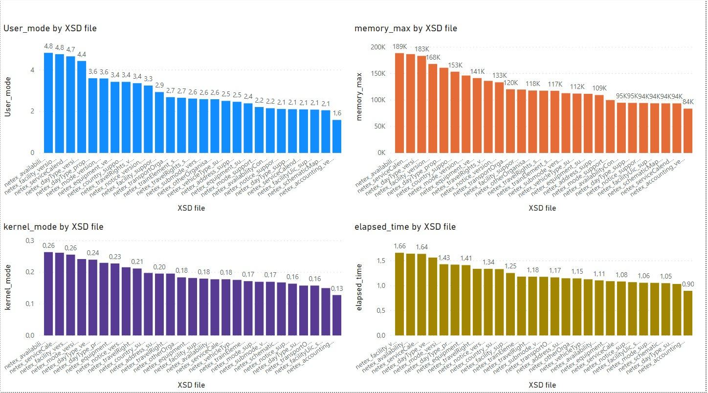

## Build

The XSD2OWL is build using Maven. A standalone jar can be found in **/target**.
```bash
cd xsd2owl
mvn install
```


## Usage

### CLI

The following options are the most important.

- `-x, --xsd <arg>`: path to XML Schema file
- `-o, --outputfile <arg>`:  path to output file in OWL format

All options can be found when executing `java -jar xsd2owl-1.0.0.jar --help`, that output is found below.

```
usage: java -jar xsd2owl-1.0.0.jar <options>
options:
 -h,--help                        show help info
 -v,--verbose                     show more details in debugging output
 -o,--outputfile <arg>            path to output file (default: output.rdf)
 -x,--xsd <arg>            		  path to XML Schema file

```


## Performance results


<p align="center">
  
</p>


